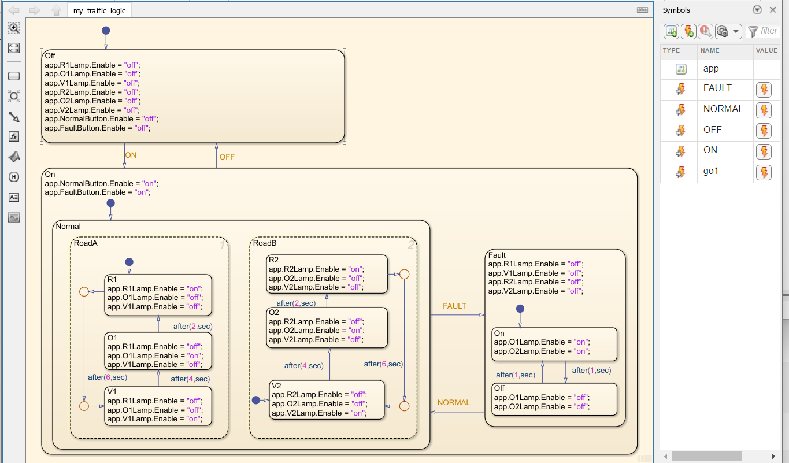
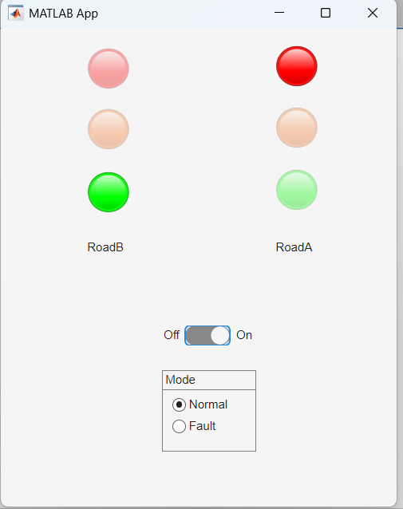

## This project is a basic application of traffic light to get hands-on Matlab App designer and Simulink state flow

The system has two modes: normal and fault, controlled by radio button

An overview of the stateflow representing the logic of the traffic light is provided bellow

The GUI designed is as follows

